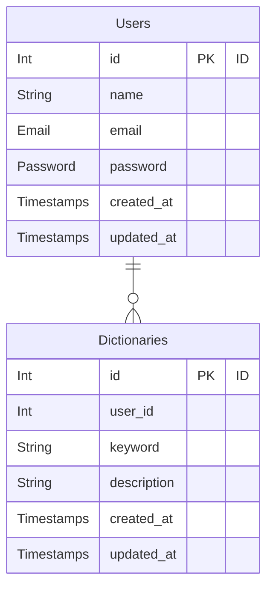

```mermaid
erDiagram
    Users ||--o{ Dictionaries : ""
    Users {
        Int id PK "ID"
        String name
        Email email
        Password password
        Timestamps created_at
        Timestamps updated_at
    }

    Dictionaries {
        Int id PK "ID"
        Int user_id
        String keyword
        String description
        Timestamps created_at
        Timestamps updated_at
    }
```
